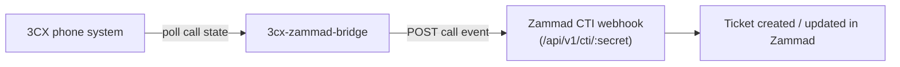

# 3CX Integration

Zammad's CTI (computer telephony integration) channel is fed by a separate
daemon — [`3cx-zammad-bridge`](https://github.com/AGM-One-Vision/3cx-zammad-bridge),
also owned by the DTO group and registered under the same
[`zammad` System](https://devhub.agmegypt.com/catalog/default/system/zammad).

## Flow

- The bridge polls 3CX (Call Control API on v20+, or username/password
  session on pre-v20) for call and queue state.
- On relevant events (inbound/outbound/missed calls), it posts to Zammad's
  CTI endpoint, which creates or updates the corresponding ticket.
- Configuration for extension digits, trunk digits, monitored queue, and
  the target Zammad CTI endpoint lives in the bridge's own `config.yaml` —
  see the bridge's
  [configuration docs](https://github.com/AGM-One-Vision/3cx-zammad-bridge/blob/main/docs/configuration.md).

## Zammad-side prerequisites

- A CTI integration must be enabled in Zammad's admin settings, generating
  the secret used in the bridge's `Zammad.endpoint` URL.
- No additional configuration is required on the Zammad/Rails side beyond
  the standard CTI channel setup described in the
  [upstream CTI docs](https://docs.zammad.org).
